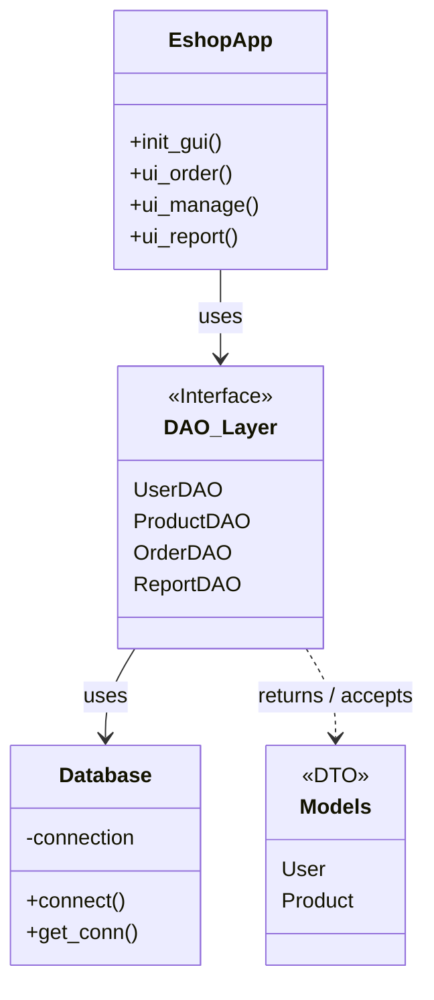

# Dokumentace projektu: Warehouse Management System (WMS)

**Autor:** Tony Menšík  
**Kontakt:** mensik.tony@gmail.com  
**Škola:** SPŠE Ječná 30    
**Datum vypracování:** 7. 1. 2026  
**Typ projektu:** Školní databázový projekt

---

## 1. Úvod a specifikace požadavků

Cílem tohoto projektu bylo vytvořit robustní desktopovou aplikaci pro správu skladu a objednávek fiktivního e-shopu. Aplikace demonstruje použití pokročilých programovacích technik, jako jsou návrhové vzory, databázové transakce a oddělení vrstev.

### Funkční požadavky (Functional Requirements)

1. **Autentizace**  
   Systém musí ověřit identitu uživatele při startu (automatické přihlášení nebo formulář).

2. **Správa katalogu**  
   Uživatel může prohlížet aktivní produkty a hromadně je importovat z externího souboru (JSON).

3. **Vytvoření objednávky**  
   Uživatel může sestavit objednávku z více položek. Systém musí zajistit atomické uložení dat.

4. **Management objednávek**  
   Oprávněný uživatel může měnit stav objednávky a mazat ji.

5. **Reporting**  
   Systém poskytuje agregovaný pohled na tržby dle kategorií v reálném čase.

---

## 2. Architektura aplikace

Aplikace je navržena podle architektury **DAO (Data Access Object)**.  
Tento přístup zajišťuje striktní oddělení prezentační vrstvy, aplikační logiky a databázové vrstvy.

### Strukturální diagram (UML – Class Diagram)


---
## 3. Popis běhu aplikace

### Stavový diagram objednávky (UML – State Diagram)

```mermaid
stateDiagram-v2
    [*] --> New : vytvoření
    New --> Paid : platba přijata
    New --> Cancelled : storno
    Paid --> Shipped : odesláno
    Shipped --> [*]
    Cancelled --> [*]

graph TD
    A[Uživatel klikne DOKONČIT] --> B{Košík prázdný?}
    B -- Ano --> C[Zobraz chybu]
    B -- Ne --> D[Zahájení transakce]
    D --> E[INSERT orders]
    E --> F[Získání ID objednávky]
    F --> G[Iterace položek]
    G --> H[INSERT order_items]
    H --> I{Vše OK?}
    I -- Ano --> J[COMMIT]
    I -- Ne --> K[ROLLBACK]
    J --> L[Vyčištění košíku]
    K --> M[Logování chyby]
```

---

## 4. Datový model (E-R model)

### Tabulky

#### `users`
- `id` (INT, PK, AutoIncrement)
- `username` (VARCHAR 50)
- `password` (VARCHAR 100)
- `is_admin` (BOOL)

#### `products`
- `id` (INT, PK)
- `name` (VARCHAR 100)
- `price` (FLOAT)
- `is_active` (BOOL)
- `category_id` (INT, FK)

#### `orders`
- `id` (INT, PK)
- `user_id` (INT, FK)
- `created_at` (DATETIME)
- `status` (ENUM: new, paid, shipped, cancelled)

#### `order_items` (M:N vazba)
- `order_id` (INT, FK)
- `product_id` (INT, FK)
- `quantity` (INT)
- `unit_price` (FLOAT)

### Databázové pohledy (Views)

- `v_active_catalog` – pouze aktivní produkty  
- `v_sales_report` – agregace tržeb dle kategorií  

## 5. Import dat (JSON)

### Specifikace souboru `data.json`

```json
[
  {
    "name": "Herní Monitor",
    "price": 5990.50
  },
  {
    "name": "USB Hub",
    "price": 250
  }
]
```

## 6. Konfigurace aplikace

Veškerá konfigurace je uložena v souboru `config/config.json`. Tento soubor definuje parametry připojení k databázi.

**Klíčové parametry:**
* `host` – Adresa databázového serveru (např. localhost).
* `user` – Uživatelské jméno.
* `password` – Heslo uživatele.
* `database` – Název databáze.

---

## 7. Instalace a spuštění

### Požadavky
* **Python 3.10+**
* **MySQL Server** (např. balíček XAMPP)

### Postup instalace
1. Nainstalujte potřebné závislosti:
   ```bash
   py -m pip install -r requirements.txt
   ```
2. Spusťe hlavní skript:
   ```bash
   py src/main.py
   ```
---

## 8. Chybové stavy a řešení

| Chybový stav | Typ chyby | Řešení |
|-------------|----------|--------|
| Nelze se připojit k DB | InterfaceError | Zkontrolujte XAMPP a `config.json` |
| Špatné přihlašovací údaje | ProgrammingError | Opravte údaje |
| Neplatný JSON | JSONDecodeError | Opravte syntaxi |
| Prázdný košík | UserWarning | Přidejte položky |

---

## 9. Použité knihovny a technologie

### Knihovny třetích stran
- `mysql-connector-python`

### Standardní knihovny Pythonu
- `tkinter`
- `json`
- `unittest`, `unittest.mock`
- `os`, `sys`

---

## 10. Závěr

Projekt **Warehouse Management System** splňuje zadání školního projektu.   
Aplikace demonstruje práci s databází, návrhovými vzory a architekturou reálného projektu.  
Systém je otestovaný a připravený k použití ve školním prostředí.